[](https://github.com/BIOP/omero-lmd/blob/main/LICENSE)

# OMERO to LMD


# Workflow

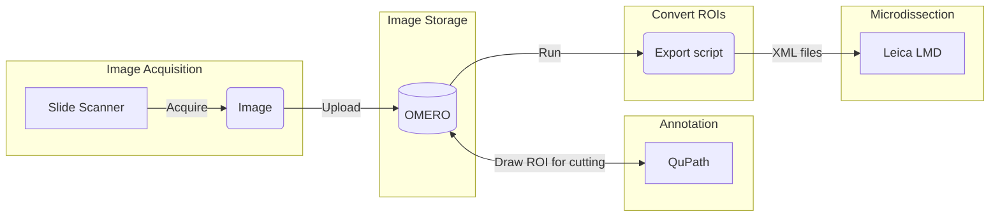

# Software installation

## OMERO client

- Recommended client [OMERO.insight](https://www.openmicroscopy.org/omero/downloads/)

## QuPath

- Install [QuPath](https://qupath.github.io/)


### QuPath OMERO extension
- On QuPath main window, go under `Extension -> Manage extensions`
- Expand the **QuPath catalog**
- Install the **QuPath OMERO** extension. Please follow [official installation instructions with extension manager](https://qupath.readthedocs.io/en/latest/docs/intro/extensions.html) from QuPath doc.

> **WARNING**: Please check that the version of the *qupath-extension-omero* is up-to-date. 
> If not, please update the extension to the latest version.


## Script

You need to create a conda environment with the following dependencies:
- python = 3.11
- omero-py
- py-lmd >= 1.4.0 (should come with scikit-image >= 0.19.0. If it is not the case, install scikit-image separately).
- pyqt6
- shapely
```
conda create -n omero-lmd-env python=3.11 pip 
conda activate omero-lmd-env
conda install -c conda-forge zeroc-ice==3.6.5
pip install omero-py pyqt6 shapely py-lmd>=1.4.0
```

# Upload images on the OMERO database

Follow the [instructions](https://wiki-biop.epfl.ch/en/data-management/omero/file-import) to upload images on OMERO.

> WARNING : If the file to upload are **.vsi** files, please follow those [SPECIAL INSTRUCTIONS](https://wiki-biop.epfl.ch/en/data-management/omero/file-import#special-case-for-vsi-files)


# Annotate regions 

The regions are annotated in QuPath
- Open an IF image
- Take the brush tool
- Annotate the regions

> **Note:** the number of regions to annotate depends on the cell area coverage. A certain amount of cell area should be annotated to be statistically relevant. 
Thus, for regions which are empty in their center, a doughnut shape has to be drawn. This lead to a Geometry ROI type in QuPath, instead of 
the standard Polygon ROI type.

Draw as many regions as you need to cut. The regions must be either a `rectangle`, an `ellipse` or a `polygon`.
Holes are accepted within an annotation i.e. geometry/complex ROI type is accepted

Assign to **each region** a class corresponding to the category of tissue, staining, or whatever that you think interesting to differentiate them.

You can also assign a name to each region, in order to differentiate them. This name, as well as the class, will appear in the *transferID* field of the LMD software.

<div align="center">
  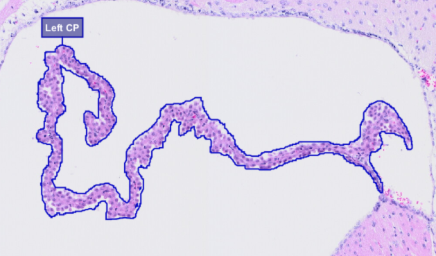
</div>

## Expand annotations

The laser cutter on the LMD microscope has a certain diameter of cutting. Thus, it is necessary to expand all the annotations by a certain 
expansion factor, to be sure to collect all the annotated cells.

- Download the script [border_expansion](QuPath scripts/border_expansion.groovy)
- Drag and drop the script in QuPath
- Modify the `expansion_um` variable with the expansion size in micrometer you would like to apply to the annotations.
- Click on Run

> **IMPORTANT**: During the expansion process, overlapping of annotations is prohibited. Thus, if two annotations are touching or are too close to each other,
> the expansion is not computed or computed until both are touching.


| Before expansion | After expansion |
|--- | ---|
| 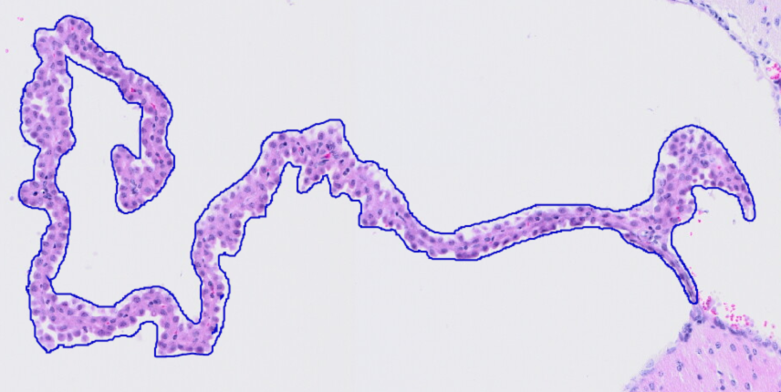| 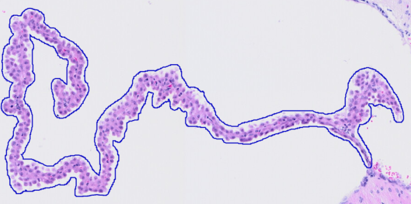|


## Assigning a well ID for the LMD microscope

To assign the well ID where you would like the cut to fall into (example: well ID `A` to put the cut in the well `A` ), you can run the script [add_well_ids.groovy](QuPath scripts/add_well_ids.groovy).
This script will assign the same well ID for all annotations of the same class.
- Download the script
- Drag and drop the script in QuPath
- Modify the `mapWellClass` variable to match your classes and the well IDs to use. 
- Set the `includeNoneClassObjects` variable to **true** if you would like to assign a well ID to annotation with no class.
- Click on Run


Some information to consider:
- If you have **more** classes than the available wells, you can add a suffix to the **Well ID**, called **Batch ID** 
- The **Batch ID** should be a **number**, separated from the **Well ID** by a **hyphen** **-**. Example: `A-1`
- If you have **less** classes than the available wells, you can, or not, add the **Batch ID**. Example, in this case, `A` and `A-1` will have the same effect.
- The **Well ID** and **Batch ID** are **NOT assigned** to an annotation if its class is NOT registered in `mapWellClass`.
- if `includeNoneClassObjects = false`,  **Well ID** and **Batch ID** are **NOT assigned** if the annotation has no class
- if `includeNoneClassObjects = true`,  you should decomment the line `"null":"A"` by removing the first `//` and replace `A-1` by the corresponding well ID to assign **Well ID** and **Batch ID**
to annotations with no class.
- The **Well ID** and **Batch ID** are saved as **measurements** linked to each annotation.

<div align="center">
  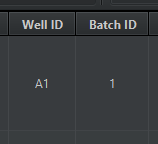
</div>

# Upload on OMERO

Once all regions have been annotated and classified
- Go under `Extension -> OMERO -> Send to OMERO -> Send annotations`
- Select `Delete existng annotations`
- Select `Delete existng measurements`
- Select `Send annotation measurements`
- Click `OK`


# Adding calibration points

**Naming covention**
- the name of the point should contain a number, different from each other (i.e 1,2,3)
- the name of the point can have some text before and / or after the number BUT the text should be the same for every points
- the names should be sortable 
- the name of the should NOT contain any special characters
- Example: `Calib1`, `Calib2`, `Calib3`


<div align="center">
  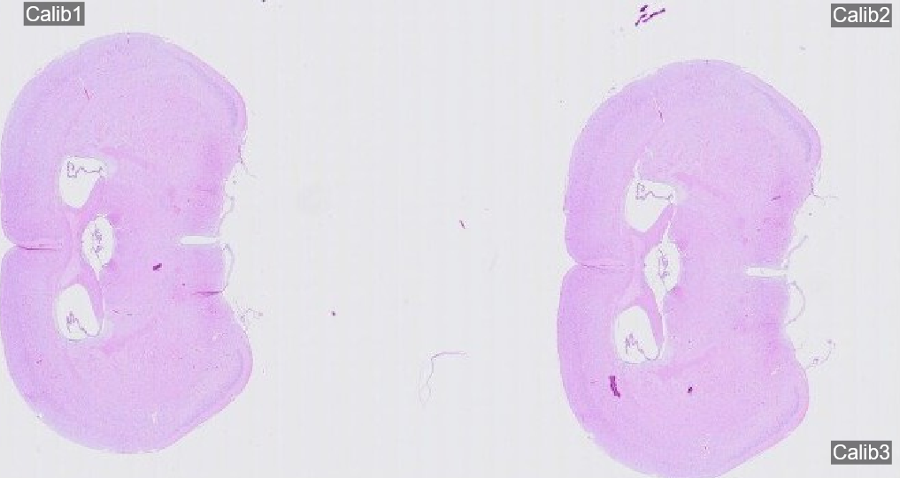
</div>

In order to localize the sample on the LMD microscope, draw **3** calibration points.
Each point has to be set in the middle of the `T` branches of the reference points, as show below.

<div align="center">
  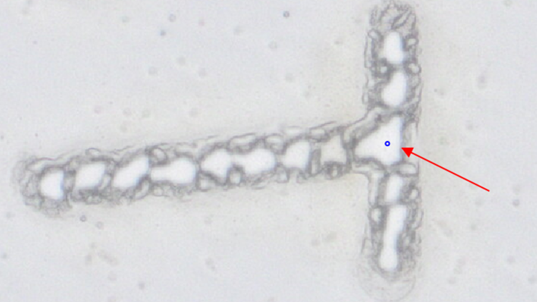
</div>

### Adding point on OMERO

- Open the image in OMERO.iviewer
- From the `ROIs` tab, click on the `Point` tool
- Add the 3 calibration points in the right location, as stated in the above convention
- Rename each point according to the above convention.
- Save the ROIs.

### Adding points on QuPath

- Open QuPath
- Load the project with the images to annotate. If the project doesn't exist yet,
create it and load images from OMERO.
- Open the image to annotate

> **BE CAREFUL**: When adding the image to the project, DO NOT IMPORT the annotations from OMERO.
> If previous annotations are already there, please delete them. 
> You should have a clean image free from any annotations.

**How to create calibration points in QuPath**.
1. Click on the `Point ROI` tool
2. In the window, click on `Add`
3. On the image, position your mouse on the point of interest and do a *click*
4. Again on the window, click on `Edit`, 
5. Give it a name, according to the above naming convention
6. Click on `Apply`
7. Again on the window, click on `Add` and repeat the above steps.

>It is possible, but not necessary, to give the points a class.


<div align="center">
  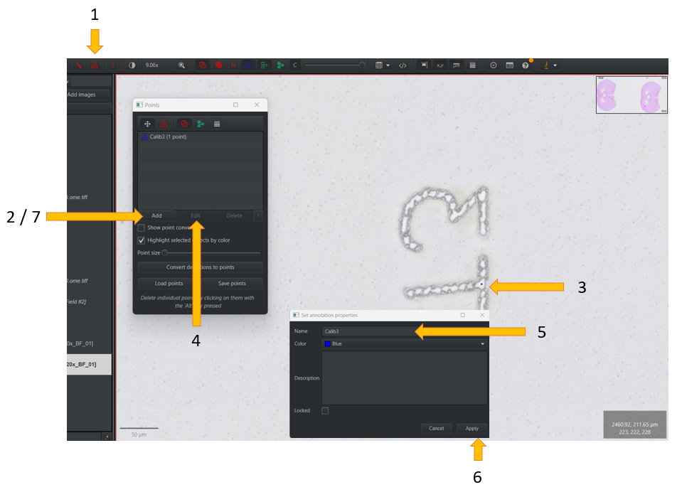
</div>

> **IMPORTANT WARNING**: ONLY POINTS should be sent to OMERO. If you have loaded all the previous annotations from OMERO or created other ones,
please deleted them from QuPath BEFORE sending the calibration points.

Once points & names are correctly assigned, send those points to OMERO 
- Go under `Extension -> OMERO -> Send to OMERO -> Send annotations`
- DO NOT Select `Delete existng annotations`
- DO NOT Select `Delete existng measurements`
- DO NOT Select `Send annotation measurements`
- Click `OK`


# Exporting OMERO ROIs to LMD format

This section shows the steps to convert OMERO ROIs to LMD readable shapes. Some important information have to be noticed
- ONLY **rectangle**, **polygon**, **ellipse**, **line** and **polyline** are supported as valid **ROI**
- ONLY **point** is supported as valid **calibration point**.
- All the **calibration points** should be named according to the above naming convention
- All the **ROIs** should be linked to a **Well ID** and to a **Batch ID**
- If a **ROI** has no **Well ID**, it will be ignored and will not appear in the final xml file
- The **Well ID** and the **Batch ID** are stored in the measurement csv table, attached to the image on OMERO.
- For **complex ROIs** i.e. ROIs with holes inside, ONLY the shape with the **maximum** area will be kept ; the others will be ignored.

#### On OMERO
- Select the images to export the ROIs from.
- Generate the URL of those images
- Copy the URL

<div align="center">
  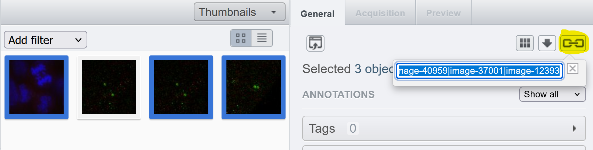
</div>

#### On a terminal

> - For **MAC** users, open the MAC terminal (`cmd + space` and search for **terminal**)
> - For **WINDOWS** users, open a CONDA/MINIFORGE terminal (also called conda/miniforge prompt)

- Activate the `omero-lmd-env`
- Run the script `Export_LMD_ROIs.py`

```
conda activate omero-lmd-env
python path/to/Export_LMD_ROIs.py
```
> **Warning**: Be careful to not have any space nor accents in your path. If you have some, please remove them.


#### In the GUI
- Enter your OMERO credentials
- Paste the URL of the images you've copied above
- Select a destination folder to save xml files.
- Select a simplification tolerance for polygon shape simplification

> Note: The LMD software doesn't handle shapes which are defined with more than 500 points. Therefore, for large polygon annotations, 
> their shape has be to simplified. The tolerance given here is the one used by the [Ramer–Douglas–Peucker algorithm](https://shapely.readthedocs.io/en/stable/reference/shapely.simplify.html),
> divided by a factor 10


- Click OK.

<div align="center">
  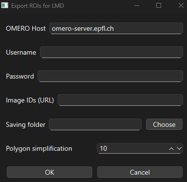
</div>

In the destination folder, and for each selected image, you should have access to:
- xml file, containing LMD-readable ROIs & calibration points.
- png file of the shape overview plot 

saved under a proper batch folder.

<div align="center">
  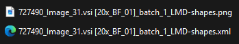
</div>

# Resources

**Code related**
 - [PyLMD repo](https://github.com/MannLabs/py-lmd)
 - [PyLMD](https://mannlabs.github.io/py-lmd/pages/notebooks/generate_xml_from_qupath_export.html) : notebook python to convert QuPath ROIs into an XML file readable in Leica LMD software
 - [QuPath to LMD](https://github.com/CosciaLab/Qupath_to_LMD)

 **Microscope related**
 - [Tuto Leica AIVIA](https://www.youtube.com/watch?v=TRTogn6xafk)


# Citing

### Code authorship

Author: Rémy Dornier (1)

**Affiliations**

(1) EPFL BioImaging and Optics Platform (BIOP)

### If you use this script, you should cite the following publication

SPARCS, a platform for genome-scale CRISPR screening for spatial cellular phenotypes Niklas Arndt Schmacke, 
Sophia Clara Maedler, Georg Wallmann, Andreas Metousis, Marleen Berouti, Hartmann Harz, Heinrich Leonhardt, Matthias Mann, 
Veit Hornung bioRxiv 2023.06.01.542416; doi: https://doi.org/10.1101/2023.06.01.542416
GitHub: https://github.com/MannLabs/py-lmd